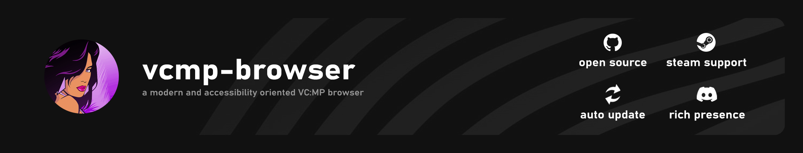
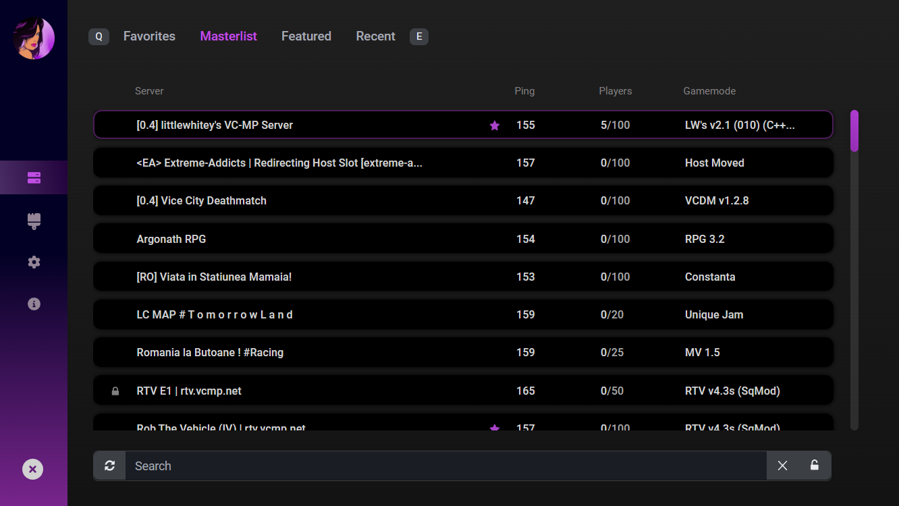

  

## Introduction
Even though the sole motivation behind this project was to try hands at [Tauri](https://tauri.studio), this project aims to provide a modern, feature rich and accessibility oriented <u>unofficial</u> [VC:MP](https://vc-mp.org) browser. 

**React** with **Vite** has been used as a frontend. **Rsuite** components have been used to design the browser alongside **Less**. Launch mechanism, Discord RPC, fetching server info over UDP, 7zip (LZMA) extraction and HTTP downloads is written in **Rust** backend. An external C++ binary is used to launch steam game.

## Preview

More screenshots on [Imgur Gallery](https://imgur.com/gallery/GKaAMb8).

---

## Features

### Auto Updater
Tauri's updater is able to deliver updates swiftly. If a new version is available, you will be prompted to install it on launch.

### Steam Support
The browser can launch both vanilla Vice City on Steam or a 1.0 downgrade patch.

Select `gta-vc.exe` if you have applied a 1.0 downgrade patch over your steam game, otherwise select `testapp.exe`.

### Custom Featured List
The `official` tab is replaced with a **Featured** List, that displays a combination of official and recommended servers. Original idea belongs to Xmair.

This can be disabled in settings.

### HTTP Downloads
For selected servers, the browser can automatically download store over HTTP instead of downloading them slowly over UDP ingame.

Store files are provided for all servers in the featured list.

### Discord Rich Presence
Displays the details of the server you're currently playing as Discord activity.

---

## Should you use this browser?
Even though Tauri has a much lighter footprint than Electron, it still is much more than the Official or Xmair's browser. 

Considering that, you can use this browser if you do prefer a beautiful interface over about 100 MBs of RAM. Otherwise I'd recommend you to use [Xmair's browser](https://forum.vc-mp.org/?topic=8398), from which this project is heavly inspired.

In other words, if you like the idea of <u>brand new Aston Martin with no mileage</u>, yeah. 

---

## Download
Head over to [releases](https://github.com/vancityspiller/vcmp-browser/releases).

---

### Webview2 Error
On earlier Windows versions, the installer may fail with the error `A program run as part of the setup did not finish as expected`.

In that case you can download [Evergreen Bootstraper](https://developer.microsoft.com/en-us/microsoft-edge/webview2/#download-section) to download Webview2 manually and rerun the setup afterwards.

---

Thanks to <u>Sebastian</u>, <u>Riddler</u> and <u>D4rKR420R</u> for beta testing alongside [OneVice](https://forum.vcmp.net/) staff. 