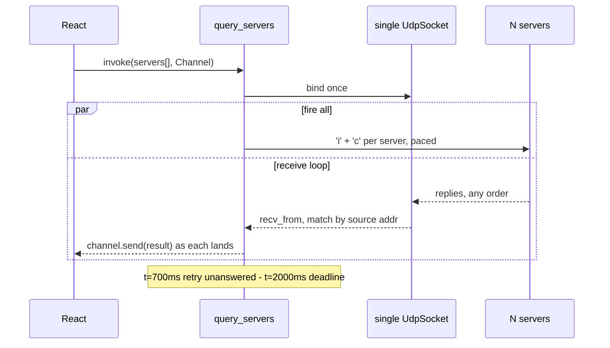

# VC:MP Browser Modernization — Design

**Date:** 2026-09-22
**Status:** Approved for planning

## 1. Purpose

The project was last touched in April 2023. Five problems need solving:

1. Steam launching shells out to a prebuilt `launcher.steam.exe`; it should be native Rust.
2. The dependency stack is ~2.5 years stale (Tauri 1.2, React 18, Vite 4, rsuite 5).
3. `vcmp.net` is gone, taking several features with it.
4. Server queries are effectively serial; a full masterlist refresh takes ~54s.
5. The code has systemic quality problems.

A sixth was found during investigation and folded in: **servers running 0.4.7.0 / 0.4.7.1 cannot be launched at all** (§4).

## 2. Decisions

| Question | Decision |
|---|---|
| Build & verification | Windows machine/VM, owned by the maintainer. No Rust toolchain for Windows exists on the dev machine. |
| Tauri | Migrate 1.2 → 2.x. Forced: `@tauri-apps/api` v2 requires a Tauri 2 backend. |
| Featured list | Derive client-side from `is_official` in the masterlist response. |
| HTTP store downloads | Remove entirely. |
| Version updater default | `https://u04.vc-mp.org/`. |
| Browser self-updater | Endpoint wired to `https://browserupdate.spiller.ovh/{{current_version}}`, left `active: false` until the host exists. |
| Frontend language | Stay JavaScript. Restructure only; no TypeScript. |
| Packet parsing | Move from JS into Rust. |
| Tests | Protocol layer only. |
| Delivery | One branch, sequenced as per-phase commits (§14). |

## 3. Measured findings

All figures gathered against live infrastructure on 2026-09-22.

**Endpoint liveness.** The whole `vcmp.net` host (`51.178.65.136`) resolves but refuses connections — `featured`, `httpdownloads`, `updater/`, `browserupdate/` all time out. Still alive: `master.vc-mp.org`, `master.thijn.ovh`, `u04.vc-mp.org`, `u04.thijn.ovh`, `dns.google`.

**Masterlist.** 59 servers, of which 6 carry `is_official: true`. The flag is already present in `/servers`, so the Featured tab needs no second request.

**Query timing.** Firing all 59 servers from one UDP socket: 38 replied within **1.04s** (`i`), 39 within 1.53s (`c`). The current design does two sequential round trips per server at a 1s timeout each — at least 42s of pure timeout against the 21 dead servers, ~54s realistically. Expected improvement is ~40–50x.

**Version distribution.** Of 35 servers that answered, 24 run `0.4.7.1`, 9 run `04rel006`, 1 runs `04rel003`, 1 reports the junk string `anti-ddos`.

## 4. The 0.4.7.x launch failure

### Root cause

`src/utils/server.util.js:84` reads the version as a fixed 8-byte slice:

```js
version: Utf8ArrayToStr(serverInfo.info.slice(11, 19))
```

The field is 12 bytes, NUL-padded. Legacy names are exactly 8 characters, so the slice worked by coincidence:

| Reported | Len | JS produces | Result |
|---|---|---|---|
| `04rel006` | 8 | `'04rel006'` | correct by luck |
| `0.4.7.1` | 7 | `'0.4.7.1\u0000'` | trailing NUL |
| `0.4.7.0` | 7 | `'0.4.7.0\u0000'` | trailing NUL |
| `anti-ddos` | 9 | `'anti-ddo'` | truncated |

### Failure chain

1. `buildVersions()` returns directory names from disk (`"0.4.7.1"`). `hasOwnProperty("0.4.7.1\0")` is **always false** — a NUL cannot appear in a Windows filename — so an installed 0.4.7.1 can never be recognised as installed. Control falls through to `check`.
2. `checkVersions()` posts to the configured updater. Against the dead `v4.vcmp.net` default this rejects, producing the reported message: *"Version 0.4.7.0 is not available locally or on updater!"*
3. Against a **live** updater it still fails, later: `/check` compares hashes, the hardcoded `00000001` never matches, so it returns a **false positive** and passes. `/download` with the NUL-bearing name then 404s.

Verified against `u04.thijn.ovh`:

```
download('0.4.7.1')     -> 4,014,991 bytes, valid 7z
download('0.4.7.0')     -> 3,987,318 bytes, valid 7z
download('0.4.7.1\x00') -> HTTP 404
```

Both versions are present on the updater. The NUL is the entire problem. Older versions never reach step 2 because they pass step 1 from disk — which is why only the new versions fail.

### Updater semantics (corrected)

`/check` is a **hash comparison**, not an existence check. Sending the real `version.txt` hash (`66B660F1` for 0.4.7.1) returns empty ("up to date"); sending a bogus hash returns the version ("update available"). It does **not** validate that a version exists, so `LaunchModal` is using it for something it cannot do.

### Fixes

1. Parse the version as NUL-terminated within its 12-byte field. Corrects all four rows above.
2. Migrate persisted settings (§8) — changing the fallback default is insufficient, because `config.utils.js:124` merges `{...fallback, ...stored}` and the stored dead URL wins.
3. Stop using `/check` as an existence check. Keep it for the startup hash comparison it is designed for; let a `/download` 404 produce one honest "not available on updater" error.

Note one intended behaviour change: the `anti-ddos` server will begin reporting its full junk string rather than the truncated `anti-ddo`. Neither is a real version, so launching fails either way — but the error message becomes truthful.

## 5. Repository structure

A Cargo workspace, so protocol code becomes verifiable on any OS — including the macOS dev machine, which has no Windows Rust target.

```
crates/vcmp-protocol/     pure: serde only. No tauri, no windows, no I/O.
  src/ lib.rs packet.rs info.rs players.rs
  tests/fixtures/         real captured packets

src-tauri/src/
  main.rs  error.rs                     thiserror AppError
  commands/ query.rs launch.rs presence.rs archive.rs
  win/                                  #[cfg(windows)]
    handle.rs                           OwnedHandle, RAII CloseHandle
    process.rs                          SuspendedProcess, terminate-on-drop
    inject.rs steam.rs
```

Windows-only crates move under `[target.'cfg(windows)'.dependencies]` so the workspace resolves off-Windows.

Frontend:

```
src/
  api/      tauri.js servers.js config.js updater.js   only layer aware of Tauri
  hooks/    useServerLists.js useServerFilters.js useListKeyboard.js
  components/ pages/
```

## 6. Wire protocol

Decoded from captured traffic; parsing consumed exactly to end-of-buffer on every sample (435/435, 93/93 bytes).

**Query:** `b"VCMP" + ip[..4] + port_str[..2] + opcode`, where opcode is `b'i'` (info) or `b'c'` (players). For `193.39.15.204:8192` that is `VCMP193.81i`.

**Reply header, 11 bytes:** `[0..4]` magic, `[4..10]` echoed 6-byte token, `[10]` echoed opcode.

Magic is `MP04` for 0.4 servers and `VCMP` for 0.3z R2 — this is the version discriminator.

**Info reply (`i`), 0.4:**

| Offset | Type | Field |
|---|---|---|
| 11..23 | 12 bytes, NUL-padded | version |
| 23 | u8 | password |
| 24..26 | u16 LE | numPlayers |
| 26..28 | u16 LE | maxPlayers |
| 28..32 | u32 LE | serverName length |
| 32.. | UTF-8 | serverName |
| then | u32 LE + bytes | gameMode |
| then | u32 LE + bytes | mapName |

**Info reply, 0.3z R2:** structurally identical, minus the 12-byte version field — every offset shifts down by exactly 12 (password 11, numPlayers 12..14, maxPlayers 14..16, nameLen 16..20, name 20..). Version is the literal `03zR2`; there is no map name (it is appended to the gamemode and split on `Vice-City`).

This -12 relationship exactly reproduces the existing `getOffsets()` table and explains it: the current JS values were empirical approximations of this structure.

**Players reply (`c`):** `[11..13]` u16 LE count, then from 13 repeated `{u8 nameLen, name}`. R2 appends one score byte per entry.

**Bugs this replaces.** The current JS reads player counts from a 1-byte slice (`server.util.js:90`), silently capping at 255, and reads u32 length prefixes as a 3-byte *sum* rather than a little-endian integer. Rust will use `u16::from_le_bytes` / `u32::from_le_bytes` and `str::from_utf8`, replacing the vendored 1999 `Utf8ArrayToStr`.

## 7. UDP query subsystem



One `tokio::net::UdpSocket`, one `invoke`, results streamed back through Tauri 2's typed `Channel<T>` so rows still populate progressively — same UX as today's `forEach`, without the serialization.

Replies are correlated by **source address** and validated against the **echoed 6-byte token**, then demultiplexed on the opcode byte at offset 10. This closes the current hole where `socket.recv()` on an unconnected socket accepts a datagram from any sender.

Retry policy: fire at t=0, retry unanswered at t=700ms, hard deadline t=2000ms. Sends are paced at 64 datagrams per batch with a yield between batches, to avoid local socket-buffer drops as the masterlist grows.

Ping remains the `i` round-trip time, now measured per-server as reply-time minus send-time.

`rpc.rs` currently carries a second, divergent copy of the parser (`rpc.rs:134`); it will consume `vcmp-protocol` instead. Its `thread::sleep(15s)` loop becomes `tokio::time::sleep` — today it pins a Tokio worker for the entire game session.

## 8. Dead endpoint removal

**Deleted:** `src/utils/httpd.utils.js`, `src-tauri/src/download.rs` and its `downloadFiles` handler, the `httpDownloads` setting and its toggle, the `httpd` step in LaunchModal's state machine, the `useLegacy` toggle, and the `v4.vcmp.net` entry in the Settings updater list.

**Kept:** creation of `%APPDATA%/VCMP/04beta/store`. It serves the game itself, not only the removed downloader. Its nested if/else ladder (`config.utils.js:88-107`) is flattened.

**Repointed:** default updater to `https://u04.vc-mp.org/`; `dns.google.com` to `dns.google` (`AddFav.jsx:89`); self-updater endpoint to `https://browserupdate.spiller.ovh/{{current_version}}` with `active: false`.

**Settings migration.** On config load, rewrite any persisted updater URL matching a known-dead host to the new default. Without this, existing installs keep the dead URL forever because stored values win the merge.

**Featured tab.** One masterlist fetch; `servers.filter(s => s.is_official)`.

**Capability HTTP scope** becomes: `master.vc-mp.org`, `master.thijn.ovh`, `u04.vc-mp.org`, `u04.thijn.ovh`, `dns.google`.

## 9. Dependency upgrades

| Package | From | To | Notes |
|---|---|---|---|
| tauri / tauri-build | 1.2 | 2.11 | allowlist to capabilities; updater becomes a plugin |
| windows | 0.36 | 0.62 | large API break: `Result` returns, `PCWSTR`/`PCSTR`, `HMODULE` |
| rust7z + `7z.dll` | 0.2 (dead since 2020) | `sevenz-rust2` 0.23 | pure Rust; removes the bundled DLL and all `u2w`/`w2u` unsafe FFI |
| window-shadows | 0.2 | *removed* | built into Tauri 2 |
| discord-rich-presence | 0.2.3 | 1.1 | |
| react / react-dom | 18.2 | 19.3 | |
| rsuite | 5.33 | 6.2 | |
| vite | 4.3 | 8.3 | |
| @vitejs/plugin-react | 4.0 | 6.1 | |

`@tauri-apps/api` splits into `plugin-fs`, `-dialog`, `-http`, `-clipboard-manager`, `-opener`, `-updater`. `appWindow` becomes `getCurrentWindow()`. `tauri.conf.json` moves to the v2 schema (`devUrl`, `frontendDist`, top-level `bundle` and `identifier`).

**The build target stays `i686-pc-windows-msvc`** — non-negotiable. The injection stub writes 32-bit pointers, and a 64-bit host's `GetProcAddress` would return an address meaningless inside the 32-bit game.

## 10. Native launcher

`external/launcher.steam.cpp` and the committed `src-tauri/launcher.steam.exe` are deleted, along with the `bundle.resources` entry. Two injection strategies sit behind one enum:

- **`remote_thread`** — existing 0.3z/0.4 path: `VirtualAllocEx` + `WriteProcessMemory` + `CreateRemoteThread(LoadLibraryA)`.
- **`entry_point_stub`** — the Steam path, ported from the C++: a 19-byte x86 stub (`push lpMem+19`; `call LoadLibraryW`; seven `pop`s; `jmp eax`) plus two `testapp.exe` patches — the CRC check at `0xA405A5` (`74` to `EB`) and the entry hook at `0xA41298`.

Both retain the C++'s assumption that kernel32 loads at the same base in both processes, true within a boot session for same-architecture processes and already relied upon by the existing code.

RAII wrappers close the handle leaks present on every current error path, including the R2-missing branch that calls `TerminateProcess` without ever closing `hThread`.

## 11. Frontend restructure

The systemic defect is `new Promise(async (resolve, reject) => ...)`, present in five util files. In `server.util.js:38` the inner `.catch(e => console.log(e))` means the returned promise **never settles on error**, so `Dashboard`'s `.forEach(... .then())` hangs forever on every failed server. Bare `.catch()` calls with no handler (`config.utils.js:137`, `Dashboard.jsx:182,199,212,233`) catch nothing.

- `src/api/` becomes the only layer that imports Tauri.
- `ServerList.jsx` (529 lines) splits: render, `useServerFilters` (the 116-line filter/sort/search memo), `ContextMenu`, `useListKeyboard`.
- `Dashboard`'s seven `useState` + three `isInitialMount` refs + four effects collapse into a `useServerLists` reducer hook.
- `navSwitching` localStorage signalling becomes real state.
- `main.jsx:10` calls `TimeAgo.addDefaultLocale(en)` above its own imports, working only via ESM hoisting; reordered.
- Rust: `.unwrap()`/`.expect()` on fallible I/O replaced with `Result` and a `thiserror` error enum.

## 12. Testing

`cargo test -p vcmp-protocol`, runnable on macOS, Windows and CI:

- 0.4 info and player parsing against real captured fixtures.
- The version-field regression: `0.4.7.1` (7 chars), `04rel006` (8), `anti-ddos` (9) — the exact cases that are broken today.
- R2 parsing against a synthetic fixture built from the derived layout.
- Empty player list; truncated and malformed packets; counts exceeding buffer length; non-UTF-8 names; the 255-player boundary.
- Query-token construction, including short IPs and short ports.

Everything else is verified by the maintainer on Windows.

## 13. Risks

| Risk | Mitigation |
|---|---|
| No R2 server is currently on the masterlist, so R2 parsing cannot be verified against real traffic | Derived structurally from the 0.4 layout (-12 offset), covered by a synthetic fixture, flagged for verification against a real R2 server |
| Steam CRC patch addresses are hardcoded to one `testapp.exe` build | Behaviour-preserving port; unchanged from the C++ that works today |
| Cannot compile or run anything locally | Protocol crate is OS-independent and tested; everything else gated on maintainer builds |
| React 19 + rsuite 6 against `ServerList`'s direct DOM ref mutation on `<Popover>` | Isolated into `ContextMenu` during the restructure; explicit smoke-test item |
| Big-bang branch with a single verifier | Sequenced per-phase commits (§14) so a broken build is bisectable |
| Masterlist growth causing UDP send-buffer drops | Paced sends plus the retry round |

## 14. Commit sequence

1. Workspace scaffold; `vcmp-protocol` crate, fixtures, tests. No behaviour change.
2. Tauri 2 + Rust dependency upgrades. Backend compiles.
3. npm upgrades and Tauri 2 plugin migration. App runs.
4. Dead endpoint removal, settings migration, Featured from `is_official`.
5. Async UDP fan-out plus frontend wiring. **Version parsing fix lands here**, resolving the 0.4.7.x failure.
6. Native Rust launcher; delete the C++ source and the committed `.exe`.
7. Frontend restructure and Rust error handling.
8. README and docs.

## 15. Out of scope

- TypeScript migration.
- Component and integration tests.
- Periodic background refresh of the server list.
- Standing up `browserupdate.spiller.ovh` (endpoint wired, left inactive).
- Replacing `javascript-time-ago` with `Intl.RelativeTimeFormat` — viable, drops two dependencies, deliberately deferred to keep this diff reviewable.
